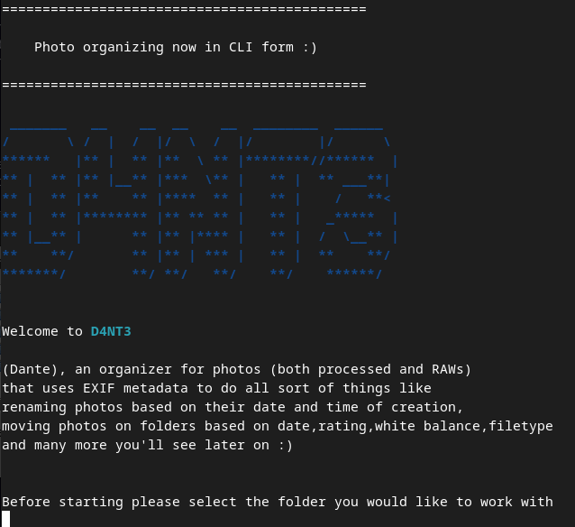
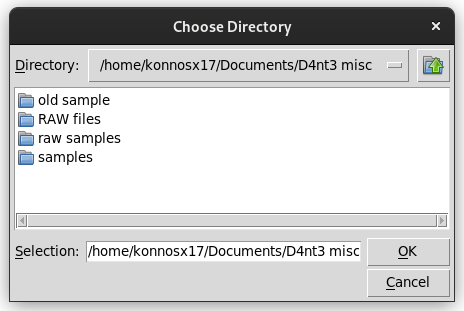

# D4NT3 The Photo Organizer

D4NT3 (Dante) is tool made in python to rename and overall organize photos based on their EXIF metadata. It uses the EXIF tool made by Phil Harvey and the PyExifTool library originally made by Sven Marnach in 2012. He originally made it as an Stackoverflow convo so you could call the EXIF tool in python scripts. So thanks to that we can do various tasks by reading,setting and deleting EXIF tags without calling the EXIF tool's cli or gui menu. 

# How D4NT3 works and what it does

For now D4NT3 does:

1. Renaming photos based on both custom user prompts and EXIF metadata(date of creation,White Balance, ISO etc.) 
2. Sorting photos in folders based also on both custom user prompt and EXIF metadata 

Down the core D4NT3 reads the EXIF tags and using os and shutil does the organizing 

# User experience  

The UI is CLI based with some basic GUI elements with the help of Tkinter. 

/CLI:
<p align="left">

</p>

/Tkinter example(User dir selection):
<p align="left">

</p>

/Windows: the user can run it with the D4NT3.exe 
/Linux: they can run it with the following commands 

~Debian based Distros:
```
cd <Dir D4nt3 is on>/D4NT3
python3 org.py
```
# Requirements 
1.Python 

2.EXIF TOOL 


# Setup
/WINDOWS

1. Install [Python](https://www.python.org/downloads/) (preferably something newer than 3.8 and lower than 3.12)
2. Install the [EXIF tool](https://exiftool.org/) windows executable
    1. Unzip the archive
    2. Rename the "exiftool(-k).exe" to "exiftool.exe"
    3. Finally add the exiftool.exe to PATH (Easiest way is to just move it to the WINDOWS folder)
3. All the other modules used are in hte libs folder so you are ready to use D4nt3

/LINUX

~Debian based distros

1. Open Terminal ~duh :), do a quick update too
```
sudo apt update
```
2. To install D4nt3:
```
git clone https://github.com/KonnosDev/D4nt3.git
```
```diff
- WARNING, This downloads D4NT3 to home, if you want to put it somewhere else please create a your dir and do install d4nt3 there. The following commands should be done in home
```

3. To install python:
```
sudo apt install python3
```
4. To install the EXIF tool:
```
sudo apt install exiftool 
```
~Arch
1. In your desired dir clone this repo:
```
git clone https://github.com/KonnosDev/D4nt3.git
```
2. install the required packages:
```
sudo pacman -S tk perl-exiftool
```
3. install python:
```
sudo pacman -S python
```

<h2>Special thanks to the following people and their teams for making the developing of D4NT3 easier:</h2>

~ tartley and wiggin15 for making and maintaining [Colorama](https://github.com/tartley/colorama)!   

~ Sven Marnach, Kevin M and etc. for making and maintaining [PyExitTool](https://github.com/smarnach/pyexiftool), plus the [PyPI](https://pypi.org/project/PyExifTool/) page!

~Phil Harvey, For making the amazing [ExifTool](https://exiftool.org/) and mainting it all this years changing it and making it robust even after the (sometimes awfull) changes of various camera companies while being active to his forums, truly a legend!
